<div align="center">
  
</div>

<div align="center">
  <sub>
    O painel acima <strong>não é uma imagem estática</strong>. Ele é redesenhado 3x por dia por um
    workflow do GitHub Actions que lê a minha própria atividade e a plota como um ativo de bolsa.
    <a href="#-como-esse-painel-funciona">Como funciona ↓</a>
  </sub>
</div>

---

## 🏦 Tese

Sou **Olavo Neves**, **Software Engineer** backend em **Java (Spring Boot / Quarkus)**, atuando dentro de um **banco de investimento** — nas plataformas que processam swaps, derivativos, renda fixa, BM&F e asset management.

Construo APIs REST e serviços orientados a eventos, e **entendo o produto financeiro que esse código movimenta**: liquidação, integração de preços com a B3 e reporte regulatório ao Bacen. Trabalho lado a lado com mesa, backoffice e compliance, e conduzo a entrega até o fim — implementação, gestão de mudança e virada em produção.

> A metáfora de terminal de mercado neste perfil não é enfeite. É onde eu trabalho.

Último semestre de **Análise e Desenvolvimento de Sistemas na FIAP** (conclusão dez/2026), com **CPA (ANBIMA)** em conclusão e **AI-200 (Azure)** em andamento.

---

## 📟 Mesa · posição atual

**Haitong — Banco de investimento** · São Paulo, SP (Faria Lima)
*Analista de Negócios (Estágio) — Engenharia e sustentação de sistemas de mercado* · mar/2026 – atual

| Indicador | Resultado |
| :--- | :--- |
| Chamados atendidos em 6 meses | **189** · responsável único pela fila |
| SLA | **95,8%** |
| Sistemas de mercado sob sustentação | **10+** |
| Gestões de mudança (GMUD) conduzidas | **148** · 130 concluídas |
| Fornecedores / sistemas / áreas de negócio | **8** · **15** · **10** |

**O que isso significa na prática:**

- **Integração com a B3** — diagnóstico e correção do fluxo de importação de cotações e taxas (`SecurityList`, `SettlementPrice`, `ReferencePrice`, `TradeInformation`), rastreando a falha da central de integrações até a replicação nas plataformas de negociação e backoffice.
- **Pós-trade** — correção de integrações de liquidação e de reporte regulatório ao Bacen entre o core de mercado e os sistemas de backoffice e compliance, com ajuste de views e rotinas em produção após mudança no modelo de dados cadastrais.
- **Automação em Python** de dois controles internos ligados a reporte regulatório (Outlook, requisições HTTP, empacotamento com PyInstaller). Um fluxo que consumia **horas de trabalho manual passou a rodar em ~10 segundos** — 3h/mês liberadas e o erro operacional eliminado.
- **Incidentes críticos em SQL Server** — loop infinito em procedure de fornecedor saturando a CPU do servidor; duplicidade de chaves bloqueando upgrade de base, corrigida com deduplicação via CTE e ajuste de view com fan-out em join.
- **Indicadores e documentação** — dashboards em Power BI publicados em produção para gestão de chamados, SLA e mudanças (modelagem DAX sobre SQL Server); manual técnico e system design de plataforma de recebíveis apresentados à diretoria.
- **Ownership operacional** de dois sistemas críticos, incluindo o de PLD/FT.

---

## 📈 Carteira de projetos

| Ativo | Classe | Stack | Tese |
| :--- | :--- | :--- | :--- |
| **NutriProgress** | Produto · em construção | `Java` `Spring Boot` `PostgreSQL` `MongoDB` `RabbitMQ` `React + TS` `Stripe` `Docker` | SaaS com backend modular, autenticação JWT/OAuth, comunicação assíncrona entre módulos via mensageria e APIs REST documentadas. |
| **Figurix** | Produto · em produção | `Next.js` `PostgreSQL + PostGIS` `Stripe` `GitHub Actions` `Vercel` | PWA com checkout session e tratamento de webhook, CI/CD e deploy contínuo. |
| **[GeoSat](https://github.com/olavoneves/geosat-java)** | Acadêmico (FIAP) | `Java Spring Boot` `C#/.NET` `Oracle PL/SQL` `Docker` | Plataforma de monitoramento com APIs em dois runtimes sobre a mesma base Oracle, containerizadas e com cobertura total de testes automatizados. |
| **[Clyvo Vet](https://github.com/olavoneves/clyvo-vet_api-java)** | Acadêmico (FIAP) | `Java` `Spring` `.NET` | API de delivery para o setor pet. |
| **[HERA](https://github.com/olavoneves/hera-api_v1)** | Acadêmico (FIAP) | `Java` `React` `Python` `SQL` | Automação do acompanhamento de pacientes no Hospital das Clínicas, com integração via WhatsApp. Reduziu absenteísmo em até **10%** em simulação. |
| **[GREEVO](https://github.com/olavoneves/Greevo)** | Acadêmico (FIAP) | `Java` `Node-RED` `IBM Cloud` | Gestão de abrigos e estoques em emergências, com chatbot. **-30%** no tempo de cadastro em teste. |
| **[BIOGURT](https://biogurt.vercel.app)** | Acadêmico · em produção | `Spring Boot` `PostgreSQL` | Plataforma do iogurte de grão-de-bico com Nutrição Santa Marcelina. |

> Os projetos acadêmicos são challenges da FIAP, independentes entre si. Estão aqui pelas decisões técnicas dentro deles — o trabalho de produção está na seção acima.

---

## 🎯 Posição em construção

> **Status:** em book · ainda não listado · abertura prevista para o fim de 2026

Um **sistema completo voltado ao mercado financeiro**, feito por conta própria. Trabalhar na sustentação e evolução das plataformas de um banco me deu o mapa do que existe; este projeto é onde eu construo do zero, juntando as três frentes que estudo em paralelo:

| Frente | O que entra |
| :--- | :--- |
| **Engenharia** | Java 17, Spring Boot 3, Quarkus, PostgreSQL, mensageria, arquitetura orientada a eventos |
| **Quantitativa** | Álgebra Linear — matrizes, decomposição e otimização aplicadas a carteiras |
| **Domínio** | Produtos financeiros — renda fixa, renda variável, derivativos, precificação (CPA/ANBIMA) |

A tese: **engenheiro que entende o produto financeiro vale mais do que engenheiro que só implementa a regra que outra pessoa escreveu.** Por isso estudo a matemática e o produto junto com a stack, não depois dela.

---

## 🧾 Alocação técnica

**🟡 Core — posição estrutural**
`Java` · `Spring Boot` · `Quarkus` · `APIs REST` · `Microsserviços` · `Arquitetura orientada a eventos` · `Design Patterns` · `SQL Server (T-SQL)` · `PostgreSQL` · `Oracle PL/SQL`

**🔵 Satélite — posição tática**
`C#/.NET` · `Python` · `React` · `Next.js` · `TypeScript` · `RabbitMQ` · `Redis` · `MongoDB` · `Docker` · `Power BI (DAX)` · `GitHub Actions` · `AWS (EC2, S3)`

**🟢 Em acumulação — aporte mensal**
`Azure (AI-200)` · `CPA (ANBIMA)` · `Álgebra Linear` · `Kubernetes` · `Kafka`

**💼 Negócio — a classe de ativo que quase nenhum dev tem**
`Swaps e derivativos` · `Renda fixa` · `BM&F` · `Asset management` · `Integração com B3` · `Liquidação` · `Pós-trade` · `PLD/FT` · `Reporte Bacen` · `Controles internos` · `Sistemas regulados` · `GMUD`

> A coluna **Δ** do painel mostra a alocação real das linguagens: quanto eu escrevi de cada uma nos últimos 5 meses comparado ao histórico total. É a única parte deste README que eu não escolho — vem dos bytes dos repositórios.

---

## 📊 Teses para 2026

| Tese | Horizonte | Status |
| :--- | :--- | :--- |
| Conclusão de ADS na FIAP | dez/2026 | 🟢 Último semestre |
| **CPA (ANBIMA)** | Curto | 🟢 Em conclusão |
| **AI-200 (Azure)** | Curto | 🟡 Em andamento |
| Sistema próprio para o mercado financeiro | Fim de 2026 | 🔴 Posição principal |
| Álgebra Linear aplicada a otimização de carteiras | Contínuo | 🟢 Em execução |
| Kafka e Kubernetes em arquitetura distribuída | Médio | 🟡 Montando posição |

---

## ⚙️ Como esse painel funciona

Cansei de ver o mesmo perfil de GitHub repetido — os mesmos três cards, o mesmo grafo de contribuição. Então construí um.

O `assets/onvs-terminal.svg` é gerado por um script Python (só stdlib, zero dependências) que roda no GitHub Actions:

```
GitHub API + calendário de contribuições
        ↓
  índice de ritmo (ONVS)
        ↓
  candles semanais + volume + média móvel
        ↓
     SVG animado em CSS  →  commit automático
```

**O índice ONVS** é a razão entre o meu ritmo curto (média exponencial de 9 dias de contribuições) e o meu ritmo estrutural (EMA de 75 dias), comprimida por um expoente para achatar dias fora da curva:

$$\mathrm{ONVS}_t = 100 \cdot \left( \frac{\mathrm{EMA}_{9}(c_t) + k}{\mathrm{EMA}_{75}(c_t) + k} \right)^{0{,}45}$$

Leitura: **100 = trabalhando no meu próprio ritmo histórico.** Acima disso estou acelerando, abaixo estou desacelerando. Como é uma razão e não juro composto, o índice oscila de verdade em vez de despencar a cada semana parada — cada candle verde ou vermelho significa alguma coisa.

O resto vem direto da fonte: **volume** são commits por semana, a **carteira de linguagens** são bytes reais por repositório, e a **fita de cotações** no rodapé mistura linguagens com os repositórios de push mais recente.

Nada é escrito à mão. Se eu passar um mês sem commitar, o painel vai mostrar isso — e essa é justamente a graça.

```bash
# rodar localmente
python scripts/build.py --user olavoneves --out assets/onvs-terminal.svg
```

---

## ☎️ Mesa de operações

São Paulo, SP · Português (nativo) · Inglês (B2)

[](https://linkedin.com/in/olavo-neves)
[](mailto:olavo9neves@gmail.com)
[](https://wa.me/5511955502307)
[](https://instagram.com/olavoneves_)

---

<div align="center">
  <sub>
    <strong>Disclaimer:</strong> rentabilidade passada não garante rentabilidade futura.
    Commit diário ajuda.
  </sub>
</div>
